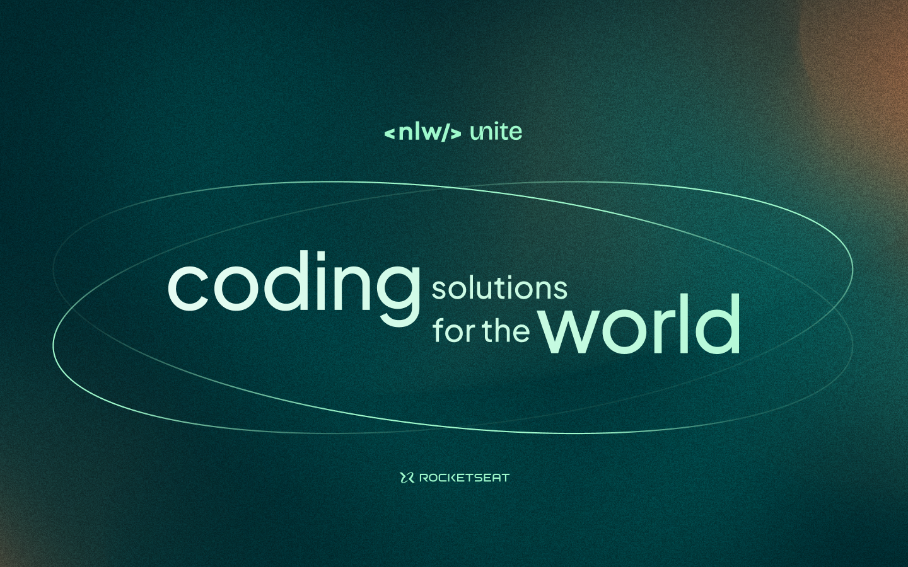

# NLW Unite - Lista de Participantes - (pass-in-web)

Este é um projeto de lista de participantes desenvolvido com VITE, React e TypeScript, como parte do evento NLW Unite da [RocketSeat](https://app.rocketseat.com.br). A lista de participantes exibe informações sobre os participantes e possui funcionalidades de paginação, busca e persistência de dados usando a URL do histórico.


[](https://app.rocketseat.com.br/events/nlw-unite/react/abertura)


## Funcionalidades

- **Paginação:** Permite navegar entre as diferentes páginas da lista de participantes.
- **Buscar referências:** Permite buscar toda ocorrência dentro da tabela.
- **Persistência de Dados:** Mantém os dados da lista de participantes na URL do navegador, possibilitando compartilhamento de links.

## Como Usar

1. Clone o repositório para sua máquina local:

```
git clone https://github.com/Vitor-Guerra/pass-in.git
```

2. Navegue até o diretório do projeto:

```
cd pass-in-web
```

3. Instale as dependências:

    3.1 Vite
    ```
    npm install vite vite-plugin-react
    ```

    3.2 Tailwind
    ```
    npm install -D tailwindcss
    ```

    ```
    npm install tailwind-merge
    ```

    3.3 DayJS
    ```
    npm install dayjs
    ```


4. Inicie o servidor de desenvolvimento:
```
npm run dev
```

### Executando a API

1. Clone o repositório para sua máquina local (em uma pasta diferente do projeto Lista de participantes):

```
git clone https://github.com/rocketseat-education/nlw-unite-nodejs.git
```

2. Navegue até o diretório do projeto:

```
cd nlw-unite-nodejs
```

3. Crie um arquivo na pasta raiz '.env' e insira os dados abaixo: 

```
DATABASE_URL='file:./dev.db'
```

4.Execute o seed do banco de dados:

```
npm install
```

```
npx prisma db seed
```

4. Inicie o servidor de desenvolvimento:

```
npm run dev
```

5. Acesse o aplicativo em seu navegador:
http://localhost:5173

## Tecnologias Utilizadas

- **React:** Utilizado para criar a interface de usuário dinâmica e responsiva.
- **TypeScript:** Linguagem de programação para adicionar tipos estáticos ao JavaScript.
- **VITE:** Ferramenta de build para projetos web modernos, utilizada para compilar o projeto React.
- **Tailwind CSS:** Framework CSS utilizado para estilização rápida e eficiente.
- **Day.js:** Biblioteca para manipulação de datas, utilizada para exibir e formatar datas na lista de participantes.

## Contribuindo

Contribuições são bem-vindas! Sinta-se à vontade para enviar pull requests com melhorias, correções de bugs ou novas funcionalidades. Lembre-se de seguir as diretrizes de contribuição e de código deste projeto.
